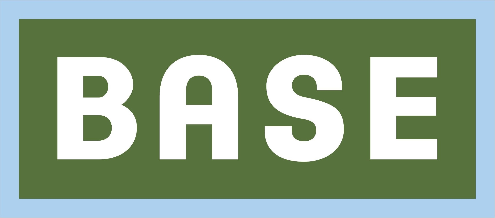

<div align="center" border="0"></div>

# base-secure

Base-secure uses [Ansible](https://www.ansible.com) to automate the hardening of the Linux OS, and its SSH configuration using code from the [DevSec Hardening Framework](https://dev-sec.io/), which maintains a set of open source templates originally developed at [Deutsche Telekom](https://www.telekom.de/start). I highly recommend you install this on a fresh Linux host, then reboot, and use that as your new base for new servers; be it a virtual machine, an Amazon Machine Image (AMI), or bare metal.

## Rational

TL;DR I get upset when I find Linux servers that are not setup well. This aims to fix that.

## Features

* Hardens the Linux OS and its SSH configuration using the excellent [DevSec Hardening Framework](https://dev-sec.io/). (NOTICE: currently using their default setttings, you could lock this down further)
* Does a full system upgrade of all installed components 
* Installs Ansible automatically if it's not installed (recommended)
* All pip installed packages (including Ansible) installed to user installation
* Clean function removes all downloaded Ansible files and uninstalls all pip installed packages, leaving nothing behind

## Requirements

* Linux (tested on Debian GNU\Linux, Arch Linux (EndeavourOS))
* python3 (tested with v3.9)
* curl
* sudo
* git

## Usage

Checkout the code, change into the directory:

```
git clone https://github.com/philcryer/base-secure.git
cd base-secure
```

Run it

```
./base-secure
```

## Cleanup

As with any server, you shouldn't have extranious things installed, so this script cleans up after itself and removes all downloaded Ansible files and uninstalls all pip packages (yep, even pip itself, if the script installed it) To do this, just run `base-secure` with the clean argument:

```
./base-secure clean
```

## License 

The MIT License (MIT)

Copyright (c) 2021 philcryer

Permission is hereby granted, free of charge, to any person obtaining a copy
of this software and associated documentation files (the "Software"), to deal
in the Software without restriction, including without limitation the rights
to use, copy, modify, merge, publish, distribute, sublicense, and/or sell
copies of the Software, and to permit persons to whom the Software is
furnished to do so, subject to the following conditions:

The above copyright notice and this permission notice shall be included in all
copies or substantial portions of the Software.

THE SOFTWARE IS PROVIDED "AS IS", WITHOUT WARRANTY OF ANY KIND, EXPRESS OR
IMPLIED, INCLUDING BUT NOT LIMITED TO THE WARRANTIES OF MERCHANTABILITY,
FITNESS FOR A PARTICULAR PURPOSE AND NONINFRINGEMENT. IN NO EVENT SHALL THE
AUTHORS OR COPYRIGHT HOLDERS BE LIABLE FOR ANY CLAIM, DAMAGES OR OTHER
LIABILITY, WHETHER IN AN ACTION OF CONTRACT, TORT OR OTHERWISE, ARISING FROM,
OUT OF OR IN CONNECTION WITH THE SOFTWARE OR THE USE OR OTHER DEALINGS IN THE
SOFTWARE.

### Thanks
